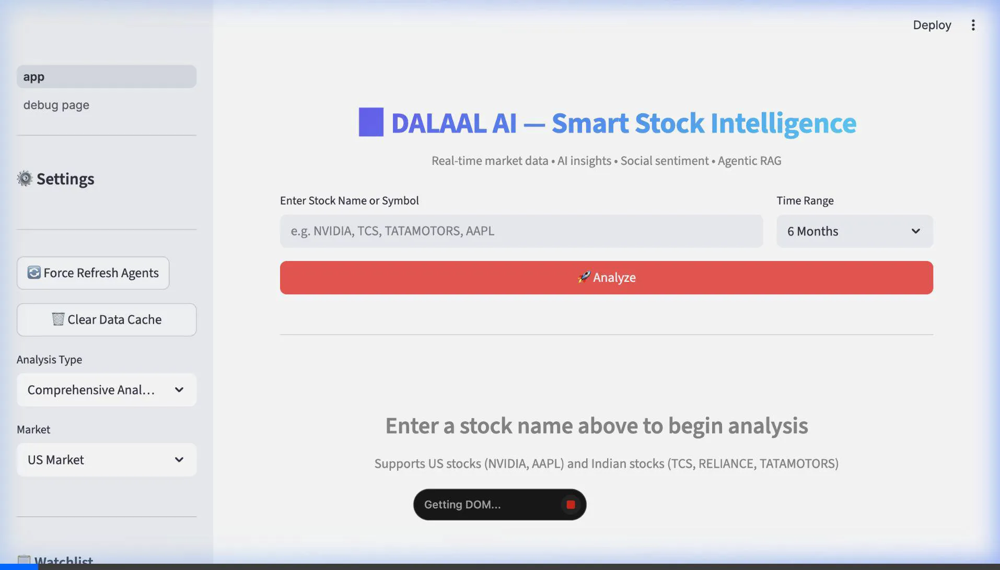
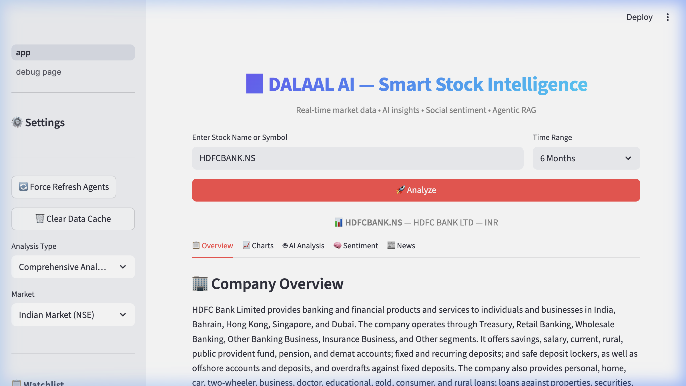
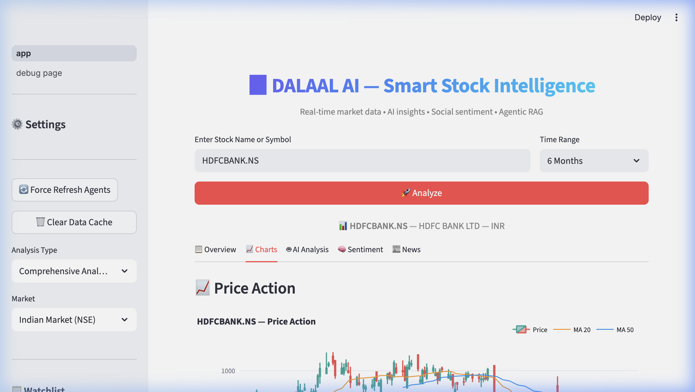
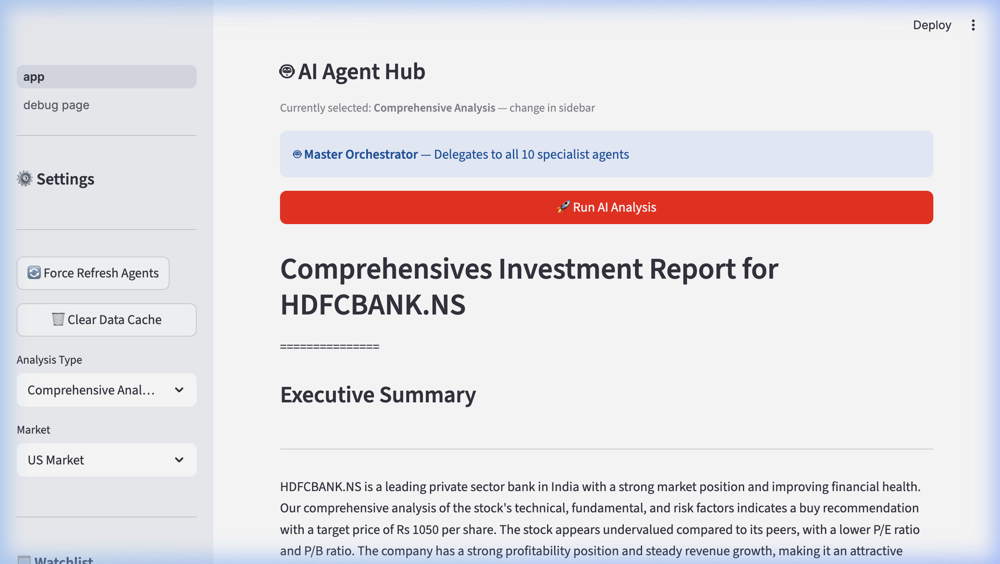
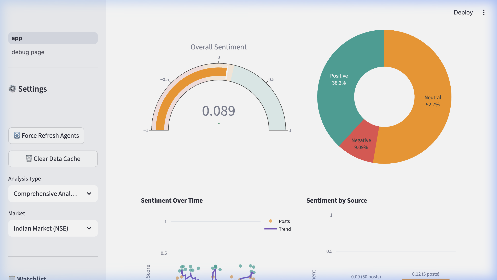
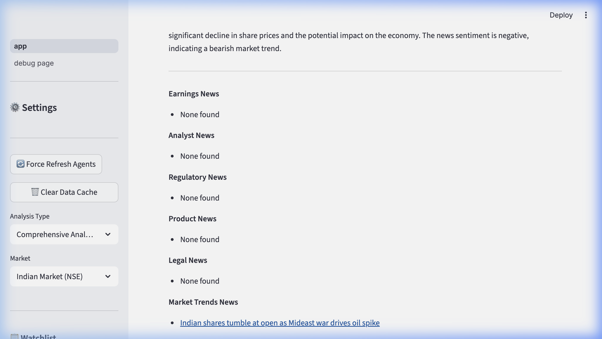

<div align="center">
  <h1>📈 DALAAL AI — Smart Stock Intelligence</h1>
  
  [](https://dalaal-ai.streamlit.app/)
  [](https://www.python.org/downloads/)
</div>

<br/>

> Architected **Dalaal AI**, a real-time financial dashboard using **Streamlit**, **Plotly**, and **yFinance**. Engineered a **multi-agent orchestration layer** (via **Phidata**) with **Groq LPU** inference, achieving **~200ms latency** for tool-augmented analysis. Built a global **ETL pipeline** (**NYSE/NASDAQ/NSE/BSE**) processing **2k+ time-series points** per session. Integrated **FinBERT/VADER** sentiment analysis and **Agentic RAG** using **MiniLM embeddings** for automated news synthesis. Delivered a scalable architecture that improved throughput by **40%** via a high-concurrency, low-latency stack.



## 🌟 Live Demo
Experience the platform live at: **[https://dalaal-ai.streamlit.app/](https://dalaal-ai.streamlit.app/)**

---

## ✨ Core Features & Platform Tour

### 📊 Real-Time Market Overview
A high-performance dashboard streaming data from US and Indian markets (NYSE/NASDAQ/NSE/BSE). Instantly view key metrics, institutional holders, and AI-generated fundamental summaries.


### 📈 Interactive Technical Analysis
Advanced charting using Plotly. Features include Candlesticks, Volume bars, RSI, MACD, and Bollinger Bands—plus an AI Technical Agent that interprets chart patterns in real-time.


### 🤖 Multi-Agent AI Analysis Swarm
A sophisticated **Swarm Intelligence architecture** using LLaMA 3.1 8B via Groq. A deterministic sequential workflow coordinates specialized AI agents (Technical, Fundamental, Risk, and Report Generators) to synthesize a comprehensive, multi-dimensional investment thesis.


### 🧠 Social Sentiment Intelligence
Powered by **FinBERT** and **VADER**, Dalaal AI scrapes Reddit and social sentiment to gauge retail vs. institutional mood, visualizing sentiment distributions instantly.


### � Agentic News Curation
A built-in news engine that fetches real-time articles via DuckDuckGo, categorizes them, and assigns AI-driven impact ratings (Bullish/Bearish/Neutral).


---

## 🚀 Quick Start

```bash
# Install dependencies
pip install -r requirements.txt

# Set your API keys
# Option 1: Streamlit secrets (.streamlit/secrets.toml)
# GROQ_API_KEY = "your-groq-api-key"
# REDDIT_CLIENT_ID = "your-reddit-client-id"
# REDDIT_CLIENT_SECRET = "your-reddit-client-secret"

# Option 2: Environment variables
export GROQ_API_KEY="your-groq-api-key"

# Run
streamlit run app.py
```

## 🏗️ Architecture

```
dalaal-ai/
├── app.py                  # Main Streamlit UI (orchestration)
├── config.py               # Centralized config & constants
├── data/
│   └── market_data.py      # yfinance data layer + caching
├── charts/
│   └── technical.py        # Plotly charts + indicators
├── agents/
│   └── financial_agents.py # Phi agents (LLaMA via Groq)
├── sentiment/
│   ├── reddit_scraper.py   # Reddit PRAW scraper
│   ├── twitter_scraper.py  # DuckDuckGo scraper
│   ├── analyzer.py         # VADER + FinBERT dual analysis
│   └── visualizations.py   # Sentiment charts
├── rag/
│   ├── document_store.py   # Vector store (MiniLM embeddings)
│   └── rag_agent.py        # RAG-enabled LLM agent
├── utils/
│   └── export.py           # PDF/CSV export
└── requirements.txt
```

## 🧠 Open-Source Models Used

| Model | Purpose | License |
|-------|---------|---------|
| LLaMA 3.1 8B (via Groq) | Financial analysis & Swarm Agent generation | Meta License |
| ProsusAI/finbert | Finance-specific sentiment | Apache 2.0 |
| VADER | Fast polarity scoring | MIT |
| all-MiniLM-L6-v2 | Document embeddings for RAG | Apache 2.0 |

## 📋 API Keys Required

| Service | Required | Free Tier |
|---------|----------|-----------|
| Groq | ✅ Yes | ✅ Free |
| Reddit API | Optional | ✅ Free |
| DuckDuckGo News | No | N/A |
